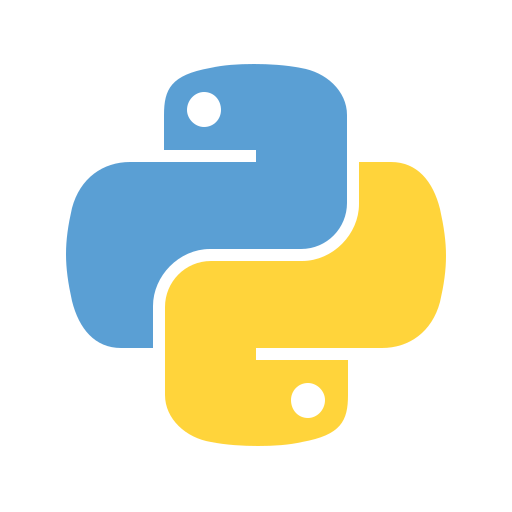

# Conhecimentos

## Linguagens de programação

  

  

  

  

## Frameworks

  

  

  

## Competências
  

  

  

  

  

## IDE

  

  

  

  Todas as Imagens Usada foram pegas em:  https://iconscout.com, https://github.com/devicons/devicon/tree/master

# Apenas Foram adicionados os principais para dar uma estética boa, se quiser ver os outros Entre aqui [Extras](Bonus.md)
